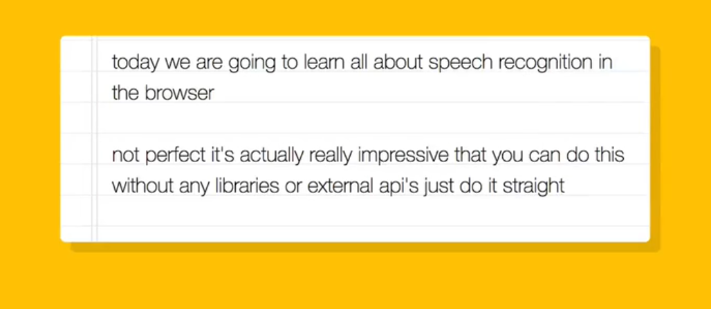

## JavaScript30 Day 20 - Speech Detection

In this tutorial, we learn speech recognition in all browser. Whenever our speech is detected, browser will translate our words and write in into the dom and displayed in a note pad.

[View demo site here.](https://webdevtuts.github.io/javascript30_20/)

